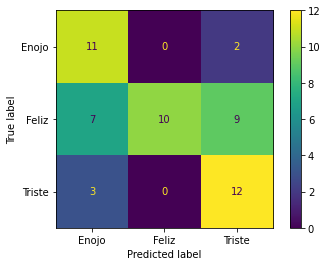
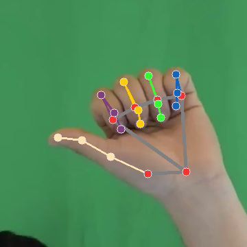
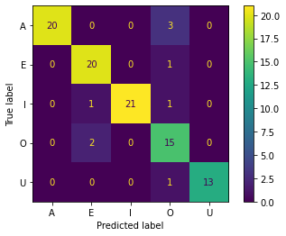

# Practicas Ciencia de Datos para Sensores Inteligentes
Estas prácticas fueron realizadas mientras estudiaba en el posgrado, específicamente en la materia de Ciencia de Datos para Sensores Inteligentes (CDSI), los datos fueron sensados y proporcionados para realizarles algún preprocesamiento y/o limpieza con el fin de alimentar modelos de aprendizaje de máquina para poder hacer inferencias (**predicciones**) sobre datos nuevos. Estas fueron mi primer acercamiento hacia la ciencia de datos.

* En la [práctica 1](https://github.com/LuisGuillermoRL/Practicas_CDSI/blob/main/Pr%C3%A1ctica_de_Audio.ipynb) el estudiante aplicará técnicas de procesamiento de voz y generará un modelo de clasificación de moods (estados emocionales) para una tarea de interacción humano-robot. Esta práctica se divide en dos fases: (i) entrenamiento y evaluación interna del modelo de clasificación, y (ii) validación externa del modelo con nuevos datos. Para la primera fase los datos fueron recopilados en un entorno controlado con ayuda del  responsable de la práctica, cada persona que fue sensada repetía la frase "estoy bien" pero en tono triste, feliz y enojado (3 veces cada una), con el fin de generar modelos de aprendizaje de máquina para ver si son capaces de distinguir el tono en que las frases se dicen. Estas grabaciones fueron compartidos en Google Drive. Para la segunda fase cada estudiante deberá recopilar nuevos datos (e.g. con un celular), y clasificar automáticamente los audios con el modelo re-entrenado. Esto es "pasarle" un conjunto de datos (Test) a los modelos entrenados para ver su capacidad con datos nuevos, cabe mencionar que además de recolectar para el Test datos de adultos también recolecté datos de audio de mis sobrinos con autorización de sus padres para evaluarlos de igual forma para observar el comportamiento del modelo. La matriz de confusión sobre los datos de validación de un modelo **Random Forest** se muestra a continuación.

* En la [práctica 2](https://github.com/LuisGuillermoRL/Practicas_CDSI/blob/main/Pr%C3%A1ctica_de_Se%C3%B1as.ipynb) el estudiante aplicará técnicas de procesamiento de imágenes y generará un modelo de clasificación de letras (cinco vocales) de la Lengua de Señas Mexicana. Esta práctica se divide en dos fases: (i) entrenamiento y evaluación interna del modelo de clasificación, y (ii) validación externa del modelo con nuevos datos. Para la primera fase los datos serán recopilados en un entorno controlado con ayuda del  responsable de la práctica y les serán compartidos mediante un repositorio en Google Drive. Para la segunda fase cada estudiante deberá recopilar nuevos datos (e.g. con un celular), y clasificar automáticamente las imágenes con el modelo re-entrenado. A continuación se muestra una mano expresando la letra A en la Lengua de Señas Mexicana y también se muestra la matriz de confusión sobre los datos de validación de un modelo **K-Nearst Neighbor (KNN)**

* En la [práctica 4](https://github.com/LuisGuillermoRL/Practicas_CDSI/blob/main/C_Pr%C3%A1ctica_Se%C3%B1as_Inerciales.ipynb) el estudiante aplicará técnicas de procesamiento de señales inerciales y generará un modelo de clasificación para la detección automática de actividades de la vida diaria. Esta práctica se divide en dos fases: (i) entrenamiento y evaluación interna del modelo de clasificación, y (ii) validación externa del modelo con nuevos datos. Para la primera fase se utilizarán los datos recopilados para un "scientific challenge" y les serán compartidos en dos datasets (train, test). Para la segunda fase se se realizará una validación externa, estos datos serán compartidos para posteriormente regresar las predicciones de los clasificadores entrenados por el estudiante. **NOTA:** se preparará un ranking con el desempeño de los clasificadores de los estudiantes.
