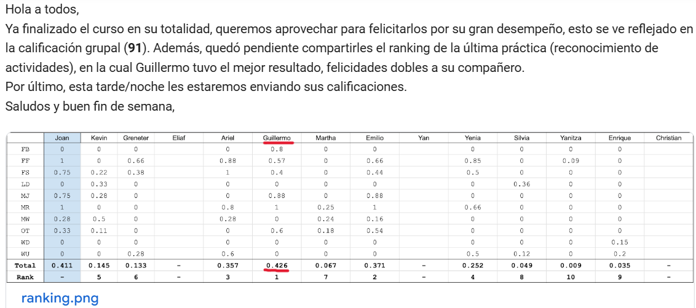

# Practices "Ciencia de Datos para Sensores Inteligentes"

These practices were carried out during my postgraduate studies, specifically in the course Data Science for Intelligent Sensors (CDSI). The data were collected through sensors and provided to us for preprocessing and/or cleaning, with the goal of feeding machine learning models to make inferences (**predictions**) on new data. These exercises marked my first experience with data science.

* In [Practice 1](https://github.com/LuisGuillermoRL/Practicas_CDSI/blob/main/Pr%C3%A1ctica_de_Audio.ipynb), students applied voice processing techniques and built a mood classification model for a human-robot interaction task. The practice was divided into two phases: (i) training and internal evaluation of the classification model, and
(ii) external validation of the model using new data. For the first phase, data were collected in a controlled environment with the support of the course instructor. Each participant repeated the phrase "estoy bien" in a sad, happy, and angry tone (3 times each) to generate training data for machine learning models that aimed to distinguish emotional tones. These recordings were shared via Google Drive. In the second phase, each student had to collect new data (e.g., using a smartphone) and automatically classify the audio using the retrained model. That is, a test dataset was passed through the trained models to evaluate their performance on unseen data. In my case, I not only collected audio data from adults but also gathered recordings from my nephews (with parental consent) to analyze how the model behaved with children's voices. Below is the confusion matrix obtained from validating a **Random Forest** model with the new test data.

* In [Practice 2](https://github.com/LuisGuillermoRL/Practicas_CDSI/blob/main/Pr%C3%A1ctica_de_Se%C3%B1as.ipynb), students applied image processing techniques and built a classification model for recognizing the five vowels of the Mexican Sign Language (LSM in Spanish). This practice was divided into two phases: (i) training and internal evaluation of the classification model, and (ii) external validation of the model using new data. For the first phase, data were collected in a controlled environment with the assistance of the course instructor and were shared with the students via a Google Drive repository. In the second phase, each student had to collect new image data (e.g., using a smartphone) and automatically classify the images using the retrained model. Below is an image showing a hand expressing the letter A in Mexican Sign Language, along with the confusion matrix obtained from validating a **K-Nearest Neighbors (KNN) model** on the new test data.

* In [Practice 4](https://github.com/LuisGuillermoRL/Practicas_CDSI/blob/main/C_Pr%C3%A1ctica_Se%C3%B1as_Inerciales.ipynb), students applied inertial signal processing techniques and built a classification model for the automatic detection of daily life activities. This practice was divided into two phases: (i) training and internal evaluation of the classification model, and (ii) external validation of the model using new data. For the first phase, the data used were collected as part of a scientific challenge and were provided in two separate datasets (train and test). For the second phase, an external validation was conducted: additional data were shared, and students had to return predictions made by their trained classifiers.

**NOTE**. A ranking was created based on the performance of each student’s classifier. Below are several images: a sample signal plot, the confusion matrix from the validation of a Random Forest model, and the ranking results of the class — with my model achieving the highest performance :astonished:.

* In the final project for the course, a task similar to Practice 4: *Activity Recognition was carried out*. Activity and/or action recognition is the process of inferring and assigning a class label to an instance or element from a dataset composed of videos, images, etc. The purpose of this document is to present the results obtained from two machine learning classifiers — Naive Bayes and Support Vector Machine (SVM) — which were used to classify three types of sensed activities: going upstairs, going downstairs, and walking on flat ground. Below, you can see the sensor placed on the foot of a participant during data collection. The report can be found [here](https://github.com/LuisGuillermoRL/Practicas_CDSI/blob/main/Proyecto/Reporte.pdf), the source code is available [here](https://github.com/LuisGuillermoRL/Practicas_CDSI/blob/main/Proyecto/Proyecto.ipynb), and an introductory video for this project can be viewed [here](https://www.youtube.com/watch?v=n4WTCJaRyX0).

